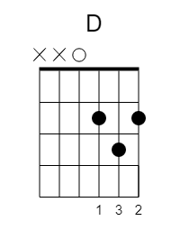
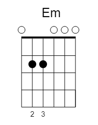
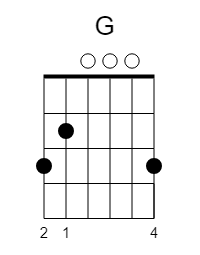

# Nagua joan da ta

* Egilea: ***Zea Mays***
* Diska: Era
* Urtea: 2010
* Tonua: D ( Zejilarekin C3-n jotzeko --> [F-ko](NeguaJoanDaTa.md) bertsioa)

```
| D  A  Em  G | x 4


D       A           Em         G        D 
Elurrak joan dire nean nire  mendien artean
      A          Em         G  
eguzkia teloian atzekaldean da. 
D    A            Em         G       D 
Ateratzeko beldur da, beldur eszenikoa,
          A              Em         G  
aspaldi antzeztu ez duen obra honetan. 


D       A           Em          G         D 
Izpi txiki-txikiren bat agertuz doa gaurkoan, 
         A           Em          G  
poztasun handi batek besarkatzen nau. 
D        A     Em        G           D 
Mesedez, ozen esan negua joan egin dela  
         A               Em         G  
nire  arima hotzak ez du sinisten eta. 


A                G                   A  
Laztandu nazazu orain ur urdinen artean, 
                  G                 A 
orain lainorik ez da, aurpegi biluziak, 
               G                  A 
ta larrua jotzean garrasirik ozenena.
               G                    D 
Gordin amaigabea... negua joan da ta.


| D  A  Em  G | x 2


D       A         Em         G              D 
Jaioberrien antzera taupaden beharra dut orain,
            A             Em                 G  
belarriekin ikusteko nire begiek entzuten ez dutena.
D        A         Em      G         D 
Mesedez, ozen esan negua joan egin dela  
      A        Em          G  
izara guztiak erre  ditut eta.


A                G                   A  
Laztandu nazazu orain ur urdinen artean,...


| D  A  Em  G |


D     A         Em 
Soinu bakar-bakarra
D    A         Em 
zure bular aldean, 
D     A       Em   G  
negua joan da ta...
D      A            Em   G         D 
Borobildu zaizkit ertzak zure ondoan. 
D    A          Em     G           D 
Izpi lasaigarri bat, negua joan da ta,
D  A          Em   G  
negua joan da ta
D     A         Em   G    
soinu bakar-bakarra,      
D    A         Em   G    
zure bular aldean,
D     A         Em        G         D       |
soinu bakar-bakarra, zure bular aldean,     | (bi aldiz)
D   A         Em      G         D 
negua joan da ta, negua joan da ta.
```


## YouTube

[](http://www.youtube.com/watch?v=7jrRM7y8yHA)

## Kitarra





