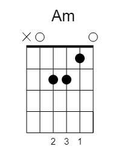

# Ni naiz

   * Egilea: ***Xabier Lete***
   * Diska: Xabier Lete
   * Urtea: 1974
   * Tonua: Am ( --> [Cm-ko](NiNaiz-Cm.md) bertsioa)


```
| Am Asus4 Am Asus2 Am |
| E7 E E7              |
| Am Asus4 Am Asus2    |


   Am
Ni naiz
         E7              Am
erreka zikinen iturri garbiak
               E7               Am Asus4 Am Asus2
aurkitu nahi dituen poeta tristea.
   Am
Ni naiz
         E7               Am
kaleetan zehar neguko eguzkitan
          E7               Am Asus4 Am Asus2
lanera dijoan gizon bakartia.
A
Ni naiz
           A7               A7_2
hostorik gabe gelditzen ari den
            Em
ardaska lehorra.
Ni naiz
pasio zahar guztiak kixkali nahi dituen
bihotz iheskorra.

Ez zaidazu galdetu gauza ilun guztien arrazoi gordeaz, 
nora ote dijoan denbora aldakorrak daraman bidea.

| Asus4 Am Asus2 |

Ni naiz
burrukaren erdian ilunpetan etsita
amore ematen duen pizti bildurtia.
Ni naiz
ezerezetik  ihes munduaren erdian
ezin aurkitutako amets urrutia. 
Ni naiz
irrifar bakoitzean gaztetasun hondarrak
galtzen dituena.
Ni naiz
itsasoko haizeak gogor astintzen dituen
lainoen negarra.

Ez zaidazu galdetu gauza ilun guztien arrazoi gordeaz, 
nora ote dijoan denbora aldakorrak daraman bidea. 

Ni naiz
txori hegalari bat lurtasun zabarrari
etsipenez loturik dadukan katea.
Ni naiz
beste asko bezala neguko eguzkitan
hotzak hiltzen dagoen gizon bakartia.
Ni naiz
lorerik gabe gelditzen ari den
ardaska lehorra.
Ni naiz
pasio zahar guztiak kixkali nahi dituen
bihotz iheskorra.

Ez zaidazu galdetu gauza ilun guztien arrazoi gordeaz,
nora ote dijoan denbora aldakorrak daraman bidea.
```

## YouTube

[](http://www.youtube.com/watch?v=3gkA9UL0YqA)

## Kitarra




